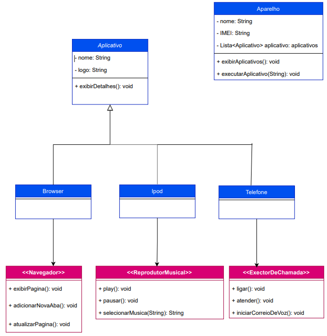

# [DIO](https://web.dio.me/track/santander-bootcamp-2023-fullstack-java-angular) - Santander Bootcamp 20023 - fullstack Java+Angular

## Autor

- [Josenildo Lins](https://github.com/josenildolins)

## POO - Desafio

Este projeto tem por objetivo a prática de diagramação UML e levantamento de requisitos, usando como base o seguinte video [Lançamento iPhone 2017](https://www.youtube.com/watch?v=9ou608QQRq8)

## Descrição do Desafio - [Autor: Gleyson Sampaio](https://github.com/digitalinnovationone/trilha-java-basico/tree/main/desafios/controle-fluxo)

Modelagem e diagramação da representação em UML e Código no que se refere ao componente iPhone.

Com base no vídeo de lançamento do iPhone conforme link abaixo, elabore em uma ferramenta de UML de sua preferência a diagramação das classes e interfaces com a proposta de representar os papéis do iPhone de: Reprodutor Musical, Aparelho Telefônico e Navegador na Internet. Em seguida crie as classes e interfaces no formato de arquivos .java

## O que foi feito

Neste projeto eu separei a implementação do código em pacotes, para melhor visualização e manutenção

1. No pacote `bootcamp.santander.classesModelos` foram adicionadas as classes que seriam utilizadas como modelos no projeto
2. No pacote `bootcamp.santander.interfaces` foram adicionadas as Interfaces
3. No pacote `package main` está localizado a classe main (classe utilizada para execução do código)

# Modelagem

# Linguagem de programação Utilizada

- Java

# IDE Utilizada

- [Visual Studio Code](https://code.visualstudio.com/Download)

# Ferramenta utilizada na Diagramação

- [draw.io](https://www.drawio.com/)
